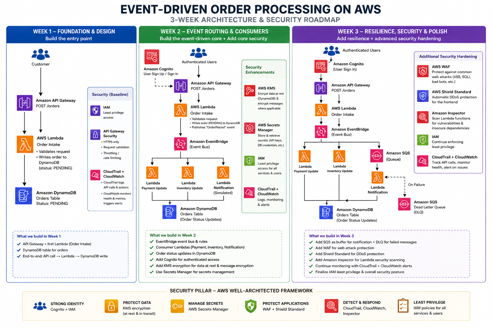
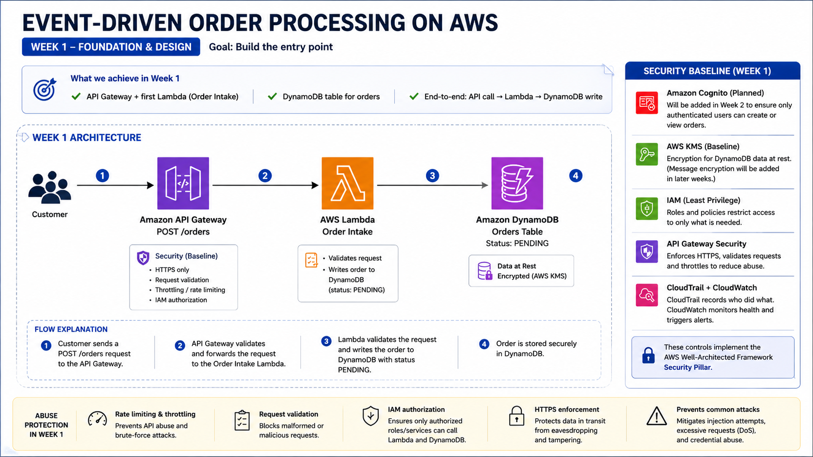
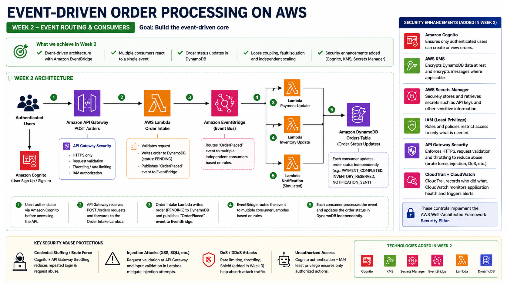
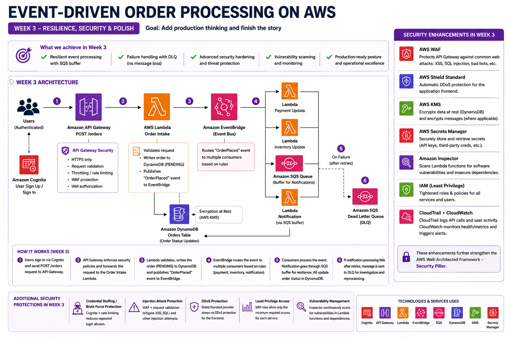

# Event-Driven Order Processing on AWS

A serverless order processing system built on AWS. The project explores how event-driven architecture works in practice.. thus how services communicate through events rather than calling each other directly, and why that makes a system easier to scale, maintain, and recover from failure.

The project runs across three weeks, with each week building on the previous week.

---

## Why event-driven

The typical approach to order processing is one function that does everything in sequence: validate, charge, update stock, send a confirmation. That works until something slows down or breaks. A slow email step holds up the whole order. A bug in inventory can roll back a payment. You are also running a server around the clock regardless of how much traffic you actually have.

With an event-driven approach, the system stores the order and fires a single event. From that point, separate services react independently. Payment does not wait on notifications. Inventory does not care what payment is doing. Each part can fail and retry on its own without taking down anything else. That independence is what this project is about.

---

## Architecture



---

## Weekly breakdown

### Week 1 - Foundation



The first week focuses on getting the core order flow working end to end. A customer sends a request, the system validates it, and the order lands in the database.

**What is built**

API Gateway exposes the `POST /orders` endpoint. The Order Intake Lambda receives the request, validates it, and writes the order to DynamoDB with a status of `PENDING`. IAM permissions are scoped so the Lambda can only write to that specific table.

**Quick start**

Deploy the stacks in this order from CloudShell:
- DynamoDB:
```bash
# 1. DynamoDB
aws cloudformation deploy \
  --template-file infrastructure/dynamodb.yaml \
  --stack-name order-processing-db \
  --parameter-overrides Environment=dev
```
- Lambda:
```bash
aws cloudformation deploy \
  --template-file infrastructure/lambda-order-intake.yaml \
  --stack-name order-processing-lambda \
  --parameter-overrides Environment=dev DynamoDBStackName=order-processing-db \
  --capabilities CAPABILITY_NAMED_IAM
```
- Upload function code: 
```bash
zip -j order-intake.zip lambdas/order-intake/index.js
aws lambda update-function-code \
  --function-name order-intake-dev \
  --zip-file fileb://order-intake.zip
```
- Get the Lambda ARN first:
```bash
LAMBDA_ARN=$(aws cloudformation describe-stacks \
  --stack-name order-processing-lambda \
  --query "Stacks[0].Outputs[?OutputKey=='OrderIntakeFunctionArn'].OutputValue" \
  --output text)
```
- API Gateway:
```bash
aws cloudformation deploy \
  --template-file infrastructure/api-gateway.yaml \
  --stack-name order-processing-api \
  --parameter-overrides ProjectName=order-processing StageName=dev OrderIntakeFunctionArn=$LAMBDA_ARN
```

Full deployment steps and testing instructions: [`docs/lambda-order-intake-deployment.md`](docs/lambda-order-intake-deployment.md)

---

### Week 2 - Event-Driven Architecture



The second week introduces EventBridge and transforms the system from a simple request-response flow into a proper event-driven architecture.

**What is built**

EventBridge is introduced as the event bus. The Order Intake Lambda now publishes an `OrderPlaced` event after writing to DynamoDB instead of handling everything itself. Three independent consumer Lambdas are added **(Payment Processing, Inventory Management, and Notification Service)** each reacting to the same event and updating order status in DynamoDB on their own.

Security is also introduced this week. Cognito handles user authentication on the API. KMS encrypts data stored in DynamoDB. Secrets Manager holds any credentials the Lambdas need. API Gateway is configured with HTTPS enforcement, request validation, and rate limiting. CloudTrail and CloudWatch are enabled for auditing and monitoring.

---

### Week 3 - Production Readiness



The final week focuses on resilience and hardening the system for production.

**What is built**

SQS is added as a buffer before the Notification Lambda so that traffic spikes and temporary failures do not drop events. A Dead Letter Queue captures any messages that fail repeatedly so nothing is silently lost. IAM policies were reviewed and tightened across all functions.

On the security side, AWS WAF is added to protect the API against common attacks like SQL injection and XSS. Shield Standard provides baseline DDoS protection and Amazon Inspector continuously scans the Lambda functions for vulnerabilities.

---

## Services across all three weeks

| Week | Services added |
|---|---|
| 1 | API Gateway, Lambda, DynamoDB, IAM |
| 2 | EventBridge, Consumer Lambdas, Cognito, KMS, Secrets Manager, CloudTrail, CloudWatch |
| 3 | SQS, Dead Letter Queue, WAF, Shield Standard, Inspector |

---

## Repository structure

```
.
├── docs/
│   ├── lambda-order-intake-deployment.md
│   ├── architecture-roadmap.png
│   └── week-1-architecture.png
├── images/
│   ├── new_architecture.png
│   ├── new_week_one.png
│   ├── new_week_two.png
│   ├── new_week_three.png
│   ├── three_week_plan.png
│   └── week_one_plan.png
├── lambdas/
│   ├── order-intake/
│   │   └── index.js
│   ├── payment-processor/
│   │   └── index.js
│   ├── inventory-update/
│   │   └── index.js
│   └── notification/
│       └── index.js
└── infrastructure/
    ├── dynamodb.yaml
    ├── lambda-order-intake.yaml
    ├── api-gateway.yaml
    ├── parameters.example.txt
    └── valid_order_structure.json
```

---

## Challenges
We will update this sectiona as and when we face challenges wih the project.
