# FreshBasket — Event-Driven Order Processing on AWS

**Fresh groceries. Smarter checkout.**

FreshBasket is a cloud-native grocery checkout platform that demonstrates how **event-driven architecture on AWS** solves a real business problem: peak-hour orders must stay fast and reliable even when payment, inventory, and notifications move at different speeds.

This repository contains:

- A production-style **serverless backend** (API Gateway, Lambda, DynamoDB, EventBridge, SQS, SES, Cognito, WAF, and more)
- A polished **Angular storefront** hosted on **AWS Amplify Hosting** (CloudFront CDN + HTTPS)
- Infrastructure as Code (CloudFormation), deployment guides, and a live demo path

**Live storefront:** [https://main.d1lubsio53fudu.amplifyapp.com](https://main.d1lubsio53fudu.amplifyapp.com)

---

## Table of contents

1. [Business objective](#1-business-objective)
2. [The problem we are solving](#2-the-problem-we-are-solving)
3. [Our solution](#3-our-solution)
4. [End-to-end architecture](#4-end-to-end-architecture)
5. [What a shopper experiences](#5-what-a-shopper-experiences)
6. [How an order moves through AWS](#6-how-an-order-moves-through-aws)
7. [AWS Well-Architected Framework](#7-aws-well-architected-framework)
8. [Trade-offs and design decisions](#8-trade-offs-and-design-decisions)
9. [How we built it over two weeks](#9-how-we-built-it-over-two-weeks)
10. [Repository map](#10-repository-map)
11. [Quick start for beginners](#11-quick-start-for-beginners)
12. [Further reading](#12-further-reading)

---

## 1. Business objective

Build an online grocery checkout that:

- Feels **instant** to the customer at busy times (evenings, weekends, promotions)
- Remains **correct** when payment, stock reservation, and email confirmations finish at different times
- Stays **available** if one downstream service is slow or fails
- Is **secure by default** (authenticated API, encrypted data, edge protection)
- Can be **explained clearly** to both technical judges and non-engineers

In short: prove that a modern AWS serverless design is not “complexity for its own sake,” but a deliberate fit for asynchronous business workflows.

---

## 2. The problem we are solving

Many grocery and retail platforms still process checkout **synchronously** on a single request path:

```text
Browser → Server → Charge card → Update inventory → Send email → Response
```

That model creates three painful failure modes during peak shopping hours:

| Failure mode | What the customer feels | Business impact |
| --- | --- | --- |
| One slow step | Long spinner / timeouts | Abandoned carts |
| Partial success | Paid but stock not reserved (or the reverse) | Support tickets, refunds, lost trust |
| Notification outage | Checkout blocked because email/SMS failed | Lost sales for a non-critical step |

A single “do everything” server (or one fat Lambda) couples latency and failure domains that should be independent.

**FreshBasket’s premise:** checkout should **accept and record** the order quickly. Everything else should react to that fact as an event.

---

## 3. Our solution

### Product name

**FreshBasket** — a demo grocery storefront backed by an event-driven AWS pipeline.

### Design in one sentence

> When a shopper places an order, the system writes the order and publishes `OrderPlaced`. Payment, inventory, and notification services consume that event independently, update DynamoDB on their own timelines, and never block the original checkout response.

### High-level request path

```text
Shopper browser
    → Amazon CloudFront (via Amplify Hosting)
        → Angular SPA (S3 origin managed by Amplify)
            → Amazon API Gateway (Cognito JWT + validation + WAF)
                → Order Intake Lambda
                    → Amazon DynamoDB (order record)
                    → Amazon EventBridge (OrderPlaced)
                        → Payment Lambda
                        → Inventory Lambda
                        → SQS → Notification Lambda → Amazon SES (email)
```

### Why this is better for grocery checkout

- **Customer latency** depends only on intake (validate + write + publish), not on email providers or inventory backends.
- **Loose coupling** lets teams (or Lambdas) evolve payment and notifications separately.
- **Resilience** means a failed email goes to a Dead Letter Queue (DLQ); the order still exists.
- **Scale** is per-function and per-queue, not “scale the whole monolith.”

---

## 4. End-to-end architecture

### Full system view

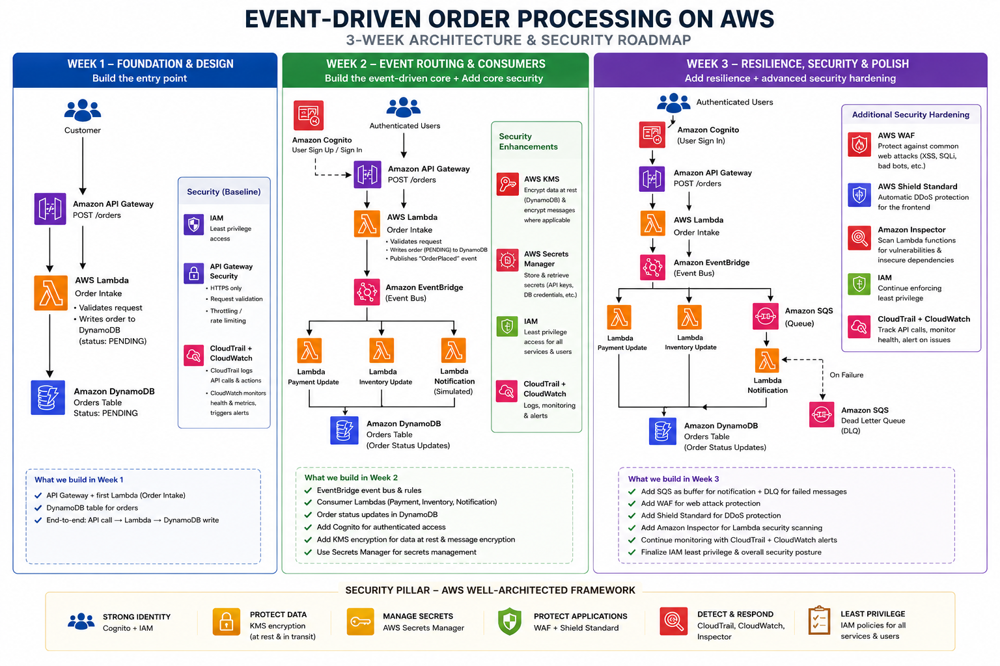

### Interactive request flow (in the app)

The Architecture page in the storefront walks judges through the same path with clickable AWS service cards:

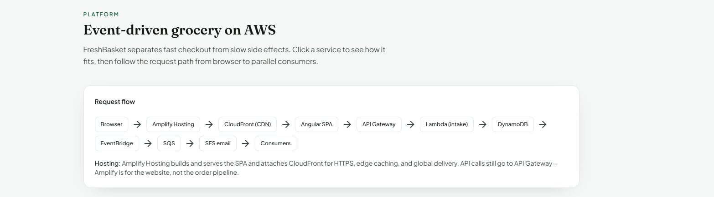

### Frontend hosting path (Amplify + CloudFront)

```text
Browser → AWS Amplify Hosting → CloudFront (HTTPS, edge cache) → Angular SPA
SPA API calls → API Gateway → Lambda (separate origin from the website)
```

Amplify Hosting is how we **build and publish** the website. CloudFront is the **CDN** Amplify attaches for global HTTPS delivery. Order traffic does **not** go through Amplify; it goes to API Gateway.

---

## 5. What a shopper experiences

These screenshots are from the live Amplify deployment.

### Landing

Brand-first grocery experience with a clear path into shopping and into the architecture story.

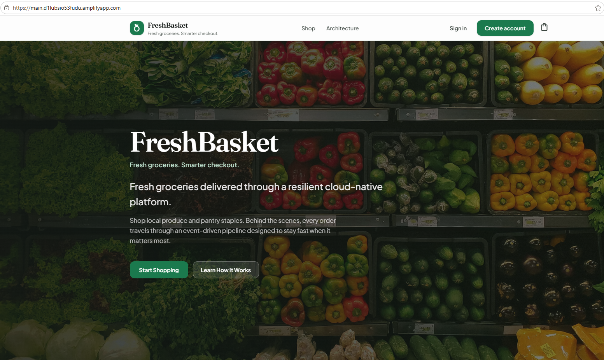

### Sign-in / welcome

Authenticated sessions use **Amazon Cognito**. After a successful sign-in, the UI greets the shopper by name.

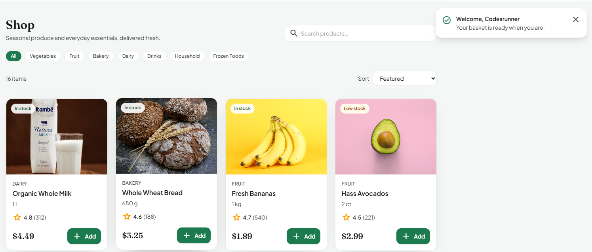

### Order success + live processing timeline

Checkout returns immediately. The success page visualizes asynchronous consumers completing independently — the same story EventBridge tells in the cloud.

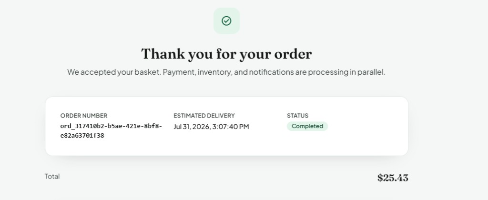

### Email confirmation (Amazon SES)

The Notification Lambda sends a transactional confirmation after `OrderPlaced` (via SQS), without holding up checkout.

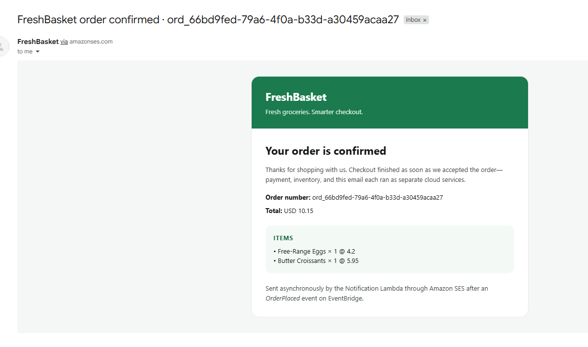

### Order history

Shoppers can review previous orders and statuses from the authenticated Orders view.

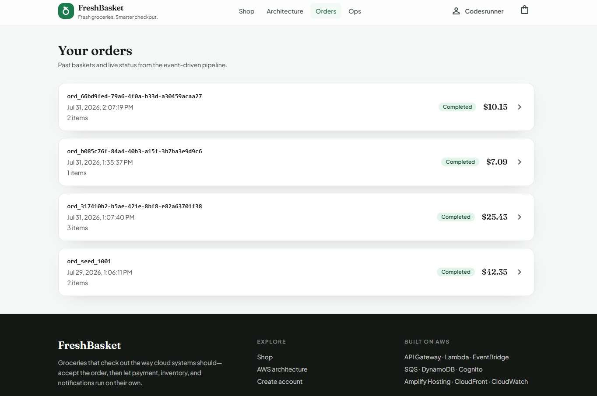

### Operations pulse (demo console)

An authenticated **Ops** view summarizes order volume, revenue, and status mix for the presentation. Treat it as an internal pulse board for the demo, not the primary shopper journey.

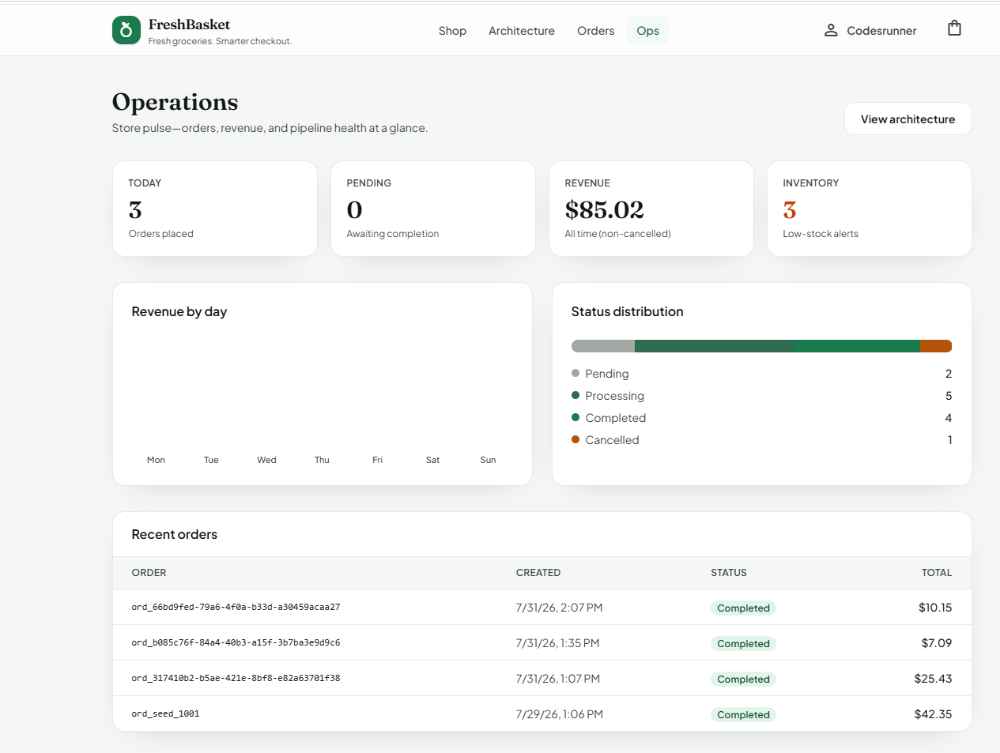

---

## 6. How an order moves through AWS

### Step-by-step (beginner-friendly)

1. **Shopper authenticates** with Cognito and receives a JWT (ID token).
2. **Browser calls** `POST /orders` on API Gateway with `Authorization: Bearer <token>`.
3. **API Gateway** checks the JWT, validates the JSON body, applies throttling, and (with WAF) filters common web exploits.
4. **Order Intake Lambda** validates business rules, writes the order to **DynamoDB** (`status: PENDING`), and publishes **`OrderPlaced`** on a custom **EventBridge** bus.
5. **API returns `201`** with `orderId` and `eventPublished: true` — the customer is done waiting.
6. **EventBridge rules** fan the same event out to:
   - Payment consumer Lambda → sets `paymentStatus = PROCESSED`
   - Inventory consumer Lambda → sets `inventoryStatus = RESERVED`
   - Notification path → **SQS queue** → Notification Lambda → **SES email** → sets `notificationStatus = SENT`
7. If notification processing fails repeatedly, the message lands in a **Dead Letter Queue** for inspection — not in the customer’s checkout spinner.

### Event contract

The shared contract is documented in [`docs/event-schema.md`](docs/event-schema.md). At a minimum, `OrderPlaced` carries `orderId`, `customerId`, optional `customerEmail`, line items, totals, and timestamps.

---

## 7. AWS Well-Architected Framework

We used the Well-Architected pillars as a checklist while hardening the system — not as decoration.

### Operational Excellence

| Practice | How FreshBasket applies it |
| --- | --- |
| Infrastructure as Code | CloudFormation templates under `infrastructure/` |
| Observability | CloudWatch logs/metrics; optional access logging / dashboards (`observability.yaml`) |
| Runbooks | Deployment and demo docs under `docs/` |
| Safe failure handling | SQS retries + DLQ for notifications |

### Security

| Practice | How FreshBasket applies it |
| --- | --- |
| Identity | Amazon Cognito user pool + API Gateway JWT authorizer |
| Edge protection | AWS WAF on the API stage; Shield Standard baseline |
| Encryption | KMS CMK option for DynamoDB; Secrets Manager for consumer credentials |
| Least privilege | Per-function IAM roles; reviewed in [`docs/PERMISSIONS.md`](docs/PERMISSIONS.md) |
| Transport | HTTPS only for API Gateway and Amplify/CloudFront site |
| Vulnerability awareness | Amazon Inspector on Lambda packages |

### Reliability

| Practice | How FreshBasket applies it |
| --- | --- |
| Decoupled failure domains | EventBridge fan-out to independent consumers |
| Buffering | SQS between EventBridge and Notification |
| Retry / poison messages | SQS redrive to DLQ |
| Stateless compute | Lambda scales with concurrency, no single always-on server |

### Performance Efficiency

| Practice | How FreshBasket applies it |
| --- | --- |
| Right-sized async work | Checkout path stays thin; heavy/side effects are async |
| Edge delivery | CloudFront in front of the SPA |
| Managed data store | DynamoDB for single-digit millisecond order key access |
| Elastic consumers | Each Lambda scales on its own workload |

### Cost Optimization

| Practice | How FreshBasket applies it |
| --- | --- |
| Pay per use | Lambda, API Gateway, EventBridge, SQS — little idle cost |
| No always-on checkout servers | No EC2 fleet for intake |
| Managed services | Less undifferentiated ops work (patching OS fleets, etc.) |

### Sustainability

| Practice | How FreshBasket applies it |
| --- | --- |
| Efficient utilization | Event-driven scale-to-zero when traffic is quiet |
| Managed efficiency | AWS-operated data centers and managed services |

---

## 8. Trade-offs and design decisions

Senior architecture is honest about what you give up.

| Decision | Benefit | Trade-off / cost |
| --- | --- | --- |
| Event-driven fan-out instead of one sync transaction | Resilience, speed, independent scale | Eventual consistency — UI must show “processing” then catch up |
| SQS in front of Notification only | DLQ story, retry isolation for email | Payment/Inventory can still be direct targets; not every path is identically buffered |
| DynamoDB single-table style order record | Simple key access, cheap reads/writes | Cross-entity analytics need other patterns (streams, warehouse) later |
| Cognito + API Gateway authorizer | Strong identity boundary | Demo accounts and SES sandbox rules need careful setup |
| SES for email | Native AWS transactional mail | Sandbox limits recipients until production access is approved |
| Amplify Hosting for SPA | Fast HTTPS deploy with CloudFront | Website and API are separate origins (CORS must be correct) |
| Simulated payment/inventory logic | Clear teaching surface for events | Not a PCI payment integration or real WMS |
| Ops dashboard in the SPA | Great for demos | Not a full multi-tenant admin RBAC product (yet) |

### Why not “just one server”?

A single server (or one synchronous function) is simpler on day one. It becomes fragile the moment email latency, inventory locks, and payment gateways share the customer’s critical path. FreshBasket keeps **servers where they belong** (short-lived Lambdas) but refuses to make the shopper wait on every downstream system.

### Why EventBridge instead of only SNS/SQS or Step Functions?

- **EventBridge** gives a clean business event bus (`OrderPlaced`) with fan-out rules — ideal for “many independent reactions.”
- **SQS** adds durability/retry where we wanted an explicit DLQ teaching moment (notifications).
- **Step Functions** would shine for a long, ordered saga with compensations; our primary demo is **parallel side effects**, not a multi-step state machine.

---

## 9. How we built it over two weeks

Early planning sketches used a three-phase roadmap. Delivery was compressed into **two focused weeks**: first stand up the event-driven core, then harden it and ship the FreshBasket customer experience.

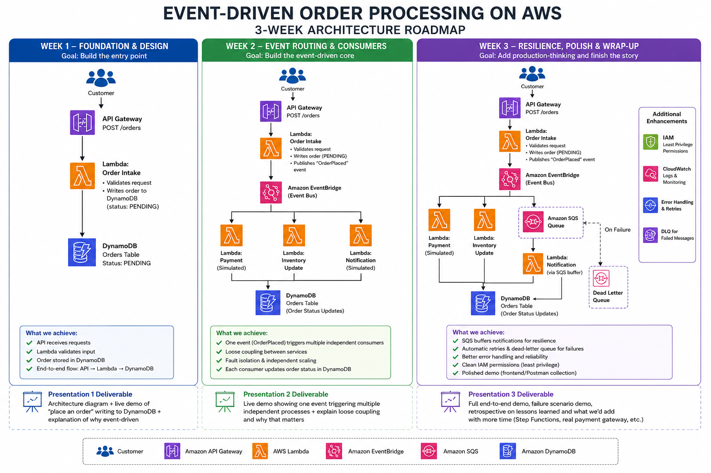

### Week 1 — Foundation + event-driven core

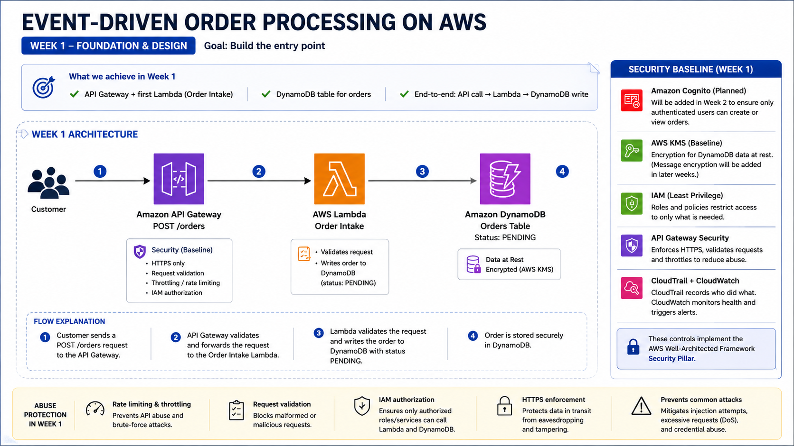

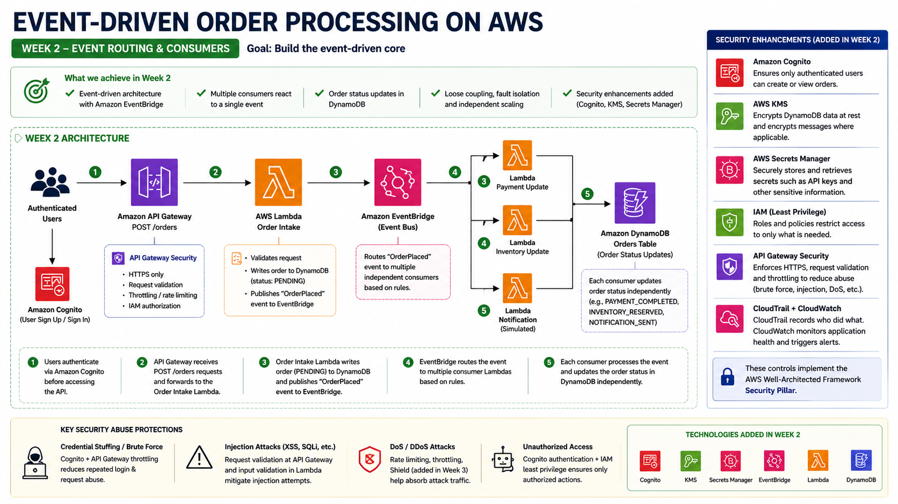

- API Gateway `POST /orders` → Order Intake Lambda → DynamoDB
- Least-privilege IAM for intake
- Custom EventBridge bus + `OrderPlaced`
- Payment, Inventory, and Notification consumer Lambdas
- Cognito authentication on the API
- Request validation, throttling, HTTPS
- KMS / Secrets Manager foundations

Guides: [`docs/lambda-order-intake-deployment.md`](docs/lambda-order-intake-deployment.md), [`docs/eventbridge-deployment.md`](docs/eventbridge-deployment.md), [`docs/auth-api-security.md`](docs/auth-api-security.md)

### Week 2 — Production readiness + FreshBasket experience

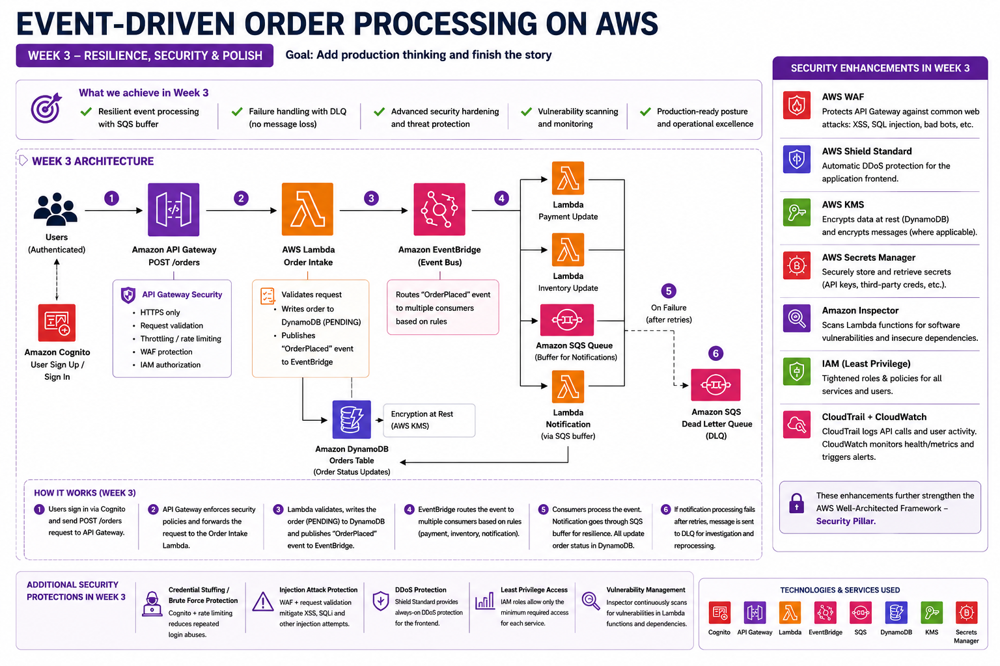

- SQS + DLQ for Notification
- WAF (+ Shield Standard baseline)
- Inspector
- CMK / Secrets wiring on consumers
- FreshBasket Angular UI on Amplify Hosting (CloudFront HTTPS)
- SES order confirmation email from the Notification Lambda
- End-to-end demo path (auth → checkout → timeline → inbox)

Guides: [`docs/sqs-dlq-inspector-deployment.md`](docs/sqs-dlq-inspector-deployment.md), [`docs/waf-shield.md`](docs/waf-shield.md), [`docs/ses-email-notifications.md`](docs/ses-email-notifications.md), [`frontend/README.md`](frontend/README.md)

### Services by week

| Week | Focus | Services / capabilities |
| --- | --- | --- |
| 1 | Intake + event bus + auth | API Gateway, Lambda, DynamoDB, IAM, EventBridge, consumer Lambdas, Cognito, KMS, Secrets Manager, CloudWatch |
| 2 | Resilience + product surface | SQS, DLQ, WAF, Shield Standard, Inspector, Amplify/CloudFront SPA, SES email notifications |

---

## 10. Repository map

```text
.
├── amplify.yml                 # Amplify Hosting build for /frontend
├── frontend/                   # Angular FreshBasket SPA
├── docs/                       # Deployment, security, demo, schemas
├── images/                     # Architecture diagrams + UI screenshots
├── infrastructure/             # CloudFormation templates
└── lambdas/
    ├── order-intake/
    ├── payment-processor/
    ├── inventory-update/
    └── notification/           # SQS consumer → SES + DynamoDB status
```

---

## 11. Quick start for beginners

### A. Explore the live app (no deploy needed)

1. Open [https://main.d1lubsio53fudu.amplifyapp.com](https://main.d1lubsio53fudu.amplifyapp.com)
2. Create an account (Cognito emails a verification code) **or** sign in with a provisioned demo user
3. Add groceries → checkout → watch the processing timeline
4. Confirm the SES email (recipient must be allowed by SES sandbox/production rules)

Demo notes: [`docs/demo-script.md`](docs/demo-script.md), [`docs/demo-auth-email.md`](docs/demo-auth-email.md)

### B. Run the frontend locally

```bash
cd frontend
npm install
npm start
```

Open `http://127.0.0.1:4200`. Set `useLiveApi: true` in `frontend/src/environments/environment.ts` to hit the real API.

### C. Deploy backend stacks (high level)

Deploy in dependency order (details live in the linked docs):

```text
data_security
  → dynamodb
  → cognito
  → sqs-dlq
  → consumers
  → eventbridge
  → lambda-order-intake
  → api-gateway
  → waf
  → (optional) observability, inspector
```

Then upload each Lambda zip (`npm install --omit=dev`, zip `index.js` + `node_modules`).

Solo checklist: [`docs/completion-checklist.md`](docs/completion-checklist.md)

---

## 12. Further reading

| Topic | Document |
| --- | --- |
| Order intake deploy & test | [`docs/lambda-order-intake-deployment.md`](docs/lambda-order-intake-deployment.md) |
| EventBridge & consumers | [`docs/eventbridge-deployment.md`](docs/eventbridge-deployment.md) |
| Cognito / API security | [`docs/auth-api-security.md`](docs/auth-api-security.md) |
| SQS / DLQ / Inspector | [`docs/sqs-dlq-inspector-deployment.md`](docs/sqs-dlq-inspector-deployment.md) |
| WAF & Shield | [`docs/waf-shield.md`](docs/waf-shield.md) |
| SES notifications | [`docs/ses-email-notifications.md`](docs/ses-email-notifications.md) |
| IAM before/after | [`docs/PERMISSIONS.md`](docs/PERMISSIONS.md) |
| Event schema | [`docs/event-schema.md`](docs/event-schema.md) |
| Frontend / Amplify | [`frontend/README.md`](frontend/README.md) |

---

## Closing thought

FreshBasket is not “Lambda for Lambda’s sake.” It is a grocery checkout shaped around a business truth: **acceptance, payment, inventory, and communication are related facts that should not share a single failure and latency domain.** EventBridge, SQS, and independent consumers make that truth operational on AWS — in a way that aligns with the Well-Architected Framework and stays explainable from first principles to a working demo.
